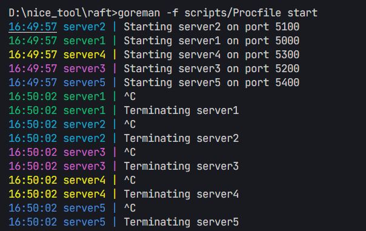
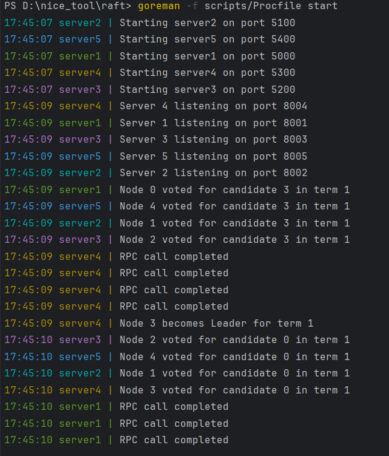
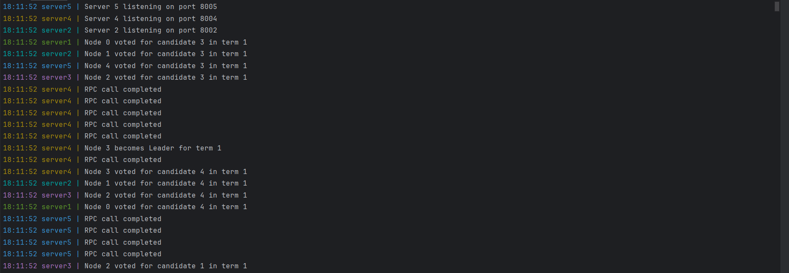

# 动手写一个简单 Raft

项目代码

简介： 这里会使用 Go简单实现一个 Raft 一致性算法，使用Go库的RPC实现

后续可能考虑加入Etcd作为注册中心以及使用gRPC进行结点间通信（画饼doge.jpg）

> 不知道为什么，明明编码集是UTF-8
>
> 且终端Active code page: 65001
> 但是打印中文还是乱码
>
> 因此该 项目 所有的打印日志等全用英文撰写，但是中文注释


----

**Tips： 有时候可能会出现奇奇怪怪的Bug**

但是我可能解决过程中，一步步测试，有时候没来得及粘贴或者忘记记录了

所以每一步完结后，我会提交代码到 Github中（基本上是测试好的，如果还有bug，可能是后续要优化的点，也可能是确确实实写的时候没有考虑到这个问题，因为我Go语言也刚刚入门，算是边学边写了）


---


# 第一步：搭建初版结构

```go
raft/
├── go.mod
├── go.sum
├── cmd/
│   └── server/
│       └── main.go 服务入口，启动一个 Raft 节点。
├── internal/
│   └── raft/
│       ├── raft.go 定义 Raft 核心结构体、基本状态。
│       ├── rpc.go 定义 RPC 接口，例如 RequestVote、AppendEntries。
│       └── config.go 配置相关（比如端口、ID之类的简单设置）。
├── scripts/
│   └── Procfile 给 goreman 启动多个节点用。
└── README.md


```


## 编写 main.go


```go
package main


import (
    "fmt"
    "log"
    "net"
    "net/rpc"
    "os"
    "strconv"

    "raft/internal/raft"
)

func main(){
	if (len(os.Args)!=3){
		log.Fatal("Not enough arguments")
		log.Fatalf("usage: server <id> <port>")
	}

	// 解析参数
	id, err := strconv.Atoi(os.Args[1])
	if err != nil {
        log.Fatalf("invalid id: %v", err)
    }

	port := os.Args[2]
	
	r := raft.NewRaft(id)

	// 注册RPC服务
	rpc.Register(r)

	// 监听端口
	listener, err := net.Listen("tcp", ":"+port)
	if err != nil {
        log.Fatalf("failed to listen: %v", err)
    }

    fmt.Printf("Server %d listening on port %s\n", id, port)


	// 接受连接并处理
	for{
		conn, err := listener.Accept()
		if err != nil{
			log.Println("Error accepting connection:", err)
			continue
		}
		go rpc.ServeConn(conn) // 服务连接
	}
}
```


## 定义结点结构以及日志Entry

```go
const (
	Follower State = iota
	Candidate
	Leader
)

type LogEntry struct{
	Term int
	Command interface{}
}

type Raft struct{
	mu sync.Mutex // 互斥锁，用于保护共享资源的访问
	id int // 节点的唯一标识符
	state State // 当前节点的状态
	currentTerm int // 当前任期号
	votedFor int // 为哪个节点投票
	log []LogEntry // 日志条目
	// todo 后续添加
}

func NewRaft(id int) *Raft {
    return &Raft{
        id:    id,
        state: Follower,
        votedFor: -1,
    }
}
```


## 投票参数 基础投票机制

```go
package  raft 


type RequestVoteArgs struct{
	Term int // 候选人的任期号
	CandidateId int // 候选人的ID
}


type RequestVoteReply struct{
	Term int // 当前任期号，以便候选人更新自己的任期号
	VoteGranted bool // true 表示候选人收到了投票
}

func (r *Raft) RequestVote(args *RequestVoteArgs, reply *ReqeuestVoteReply)error{
	r.mu.Lock() // 加锁，保护共享资源的访问
	defer r.mu.Unlock() // 函数结束时解锁，确保资源被正确释放


	if args.Term < r.currentTerm{ // 如果候选人的任期号小于当前任期号，拒绝投票
		reply.Term = r.currentTerm
		reply.VoteGranted = false
		return nil	
	}

	// todo 后续补充更多投票逻辑

	reply.VoteGranted = true // 候选人收到了投票
	reply.Term = args.Term // 更新任期号
	r.votedFor = args.CandidateId // 记录为哪个节点投票
    	// 打印谁给哪个候选人投票
	fmt.Printf("Node %d voted for candidate %d in term %d\n", r.id, args.CandidateId, args.Term)

	return nil
}
```


## goreman 配置文件

> 这里先简答使用goreman启动多个结点实例

```go
server1: go run cmd/server/main.go 1 8001
server2: go run cmd/server/main.go 2 8002
server3: go run cmd/server/main.go 3 8003
server4: go run cmd/server/main.go 4 8004
server5: go run cmd/server/main.go 5 8005

```

```bash
// 终端启动命令
goreman -f scripts/Procfile start

```




# 初版核心功能编写

## 1.结点通信

### 修改结构体

加入peers字段，记录结点信息

```go
type Raft struct{
	mu sync.Mutex // 互斥锁，用于保护共享资源的访问
	id int // 节点的唯一标识符
	state State // 当前节点的状态
	currentTerm int // 当前任期号
	votedFor int // 为哪个节点投票
	log []LogEntry // 日志条目
	// todo 后续添加

	peers[]string // 集群中的其他节点
}
```

同时创建新结点也更改一下

```go
func NewRaft(id int, peers []string) *Raft {
    return &Raft{
        id:    id,
        state: Follower,
        votedFor: -1,
        peers: peers,
    }
}

```


## 2.超时选举机制

### 选举定时器

> 添加 超时时间字段以及超时事件 以及初始化

```go
type Raft struct{
	mu sync.Mutex // 互斥锁，用于保护共享资源的访问
	id int // 节点的唯一标识符
	state State // 当前节点的状态
	currentTerm int // 当前任期号
	votedFor int // 为哪个节点投票
	log []LogEntry // 日志条目
	// todo 后续添加

	peers[]string // 集群中的其他节点
	electionTimeout time.Duration // 选举超时时间
	electionResetEvent chan struct{} // 选举超时事件
}

func NewRaft(id int,peers[]string) *Raft {
    return &Raft{
        id:    id,
        state: Follower,
        votedFor: -1,
		peers: peers,
		electionTimeout: randomElectionTimeout(), // 随机 150ms-300ms
		electionResetEvent: make(chan struct{}),
    }
}

func randomElectionTimeout() time.Duration {
    return time.Duration(150+rand.Intn(150)) * time.Millisecond
}
```


#### time源码番外

```go
// The Timer type represents a single event.
// When the Timer expires, the current time will be sent on C,
// unless the Timer was created by AfterFunc.
// A Timer must be created with NewTimer or AfterFunc.
type Timer struct {
	C <-chan Time // 当 Timer 过期时，当前时间将发送到 C 通道
	r runtimeTimer    // 运行时定时器
}
因此我们使用 通道判断 是否超时
通过select 进行阻塞
```

1. **启动超时选举检测**

```go
func (r *Raft) startElectionTimer() {
    go func() {
       for {
          timeout := r.electionTimeout    // 随机超时时间
          timer := time.NewTimer(timeout) // 创建一个新的定时器
          select {
          case <-timer.C: // time 通道 详情
             r.startElection() // 超时 进入选举
          case <-r.electionResetEvent:
             // 收到重置事件，停止定时器
             timer.Stop()
          }
       }
    }()
}
electionResetEvent 是一个控制信号，不是计时器本身，
它是用来通知 Timer“停止重新来一遍”的！

也就是说，重置 electionResetEvent，并不会直接改变 timer，
而是通过通知，停止当前timer，重新启动一个新的timer。
```

2. 修改创建结点实例

> 创建新结点直接启动定时器

```go
func NewRaft(id int, peers []string) *Raft {
	r := &Raft{
		id:                 id,
		state:              Follower,
		votedFor:           -1,
		peers:              peers,
		electionTimeout:    randomElectionTimeout(), // 随机 150ms-300ms
		electionResetEvent: make(chan struct{}),
	}
	r.startElectionTimer() // 启动选举定时器
	return r
}

```


### 发起选举

> 先写一个基本的发起选举请求，超过n/2票数即可成为 Leader

```go

// startElection 启动选举
func (r *Raft) startElection() {
	r.mu.Lock()
	r.state = Candidate
	r.currentTerm += 1 // 增加当前任期号
	r.votedFor = r.id // 投票给自己
	r.mu.Unlock()

	votes := 1
	var mu sync.Mutex // 保护 votes 变量的并发访问
	var wg sync.WaitGroup // 等待所有投票请求完成

	for i, peer := range r.peers {
		if i == r.id {
			continue // 不给自己投票
		} 
		wg.Add(1) // 增加等待组计数器
		go func(peer string) {
			defer wg.Done()
			args := &RequestVoteArgs{ // 请求投票参数
				Term: r.currentTerm,
				CandidateId: r.id,
			}
			var reply RequestVoteReply
			if Call(peer, "Raft.RequestVote", args, &reply) {
				mu.Lock()
				if reply.VoteGranted { // 如果投票成功
					votes++
				}
				mu.Unlock()
			}
		}(peer)
	}

	wg.Wait() // 等待所有投票请求完成

	r.mu.Lock()
	// 如果当前状态是候选人，并且获得了超过半数的投票
	if r.state == Candidate && votes > len(r.peers)/2 { 
		r.state = Leader
		fmt.Printf("Node %d becomes Leader for term %d\n", r.id, r.currentTerm)
	}
	r.mu.Unlock()
}
```


### RPC 通信

> 在rpc.go 中进行加入

```go
import (
	"net/rpc"
	"time"
)
使用标准库中的RPC
```

实现一个基本的RPC通信, 暂不处理返回结果以及重试机制

```go
// call 发送 RPC 请求
func Call(addr string, method string, args interface{}, reply interface{}) bool {
	client, err := rpc.Dial("tcp", addr) // 创建一个 TCP 客户端连接
	if err != nil {
		return false
	}
	defer func(client *rpc.Client) {
		err := client.Close()
		if err != nil {
			// 处理关闭连接时的错误
			return
		}
	}(client) // 确保在函数结束时关闭连接

	call := client.Go(method, args, reply, nil) // 异步调用 RPC 方法
	select {
	case <-call.Done:
		fmt.Println("RPC call completed")
		return call.Error == nil // 返回调用结果
	case <-time.After(5 * time.Second):
		// 超时处理
		fmt.Println("RPC call timed out")
		return false
	}
}

```


### 选举测试

我们先将结点地址写死, 后续考虑使用配置文件或者注册中心

```go
func main() {
	rand.Seed(time.Now().UnixNano()) // 随机超时

	if len(os.Args) != 3 {
		log.Fatalf("usage: server <id> <port>")
	}

	id, err := strconv.Atoi(os.Args[1])
	if err != nil {
		log.Fatalf("invalid id: %v", err)
	}
	port := os.Args[2]

	peers := []string{
		"localhost:8001",
		"localhost:8002",
		"localhost:8003",
		"localhost:8004",
		"localhost:8005",
	}

	r := raft.NewRaft(id-1, peers) // 创建 Raft 实例

	rpc.Register(r) // 注册 RPC 服务

	listener, err := net.Listen("tcp", ":"+port)
	if err != nil {
		log.Fatalf("listen error: %v", err)
	}

	fmt.Printf("Server %d listening on port %s\n", id, port)

	for {
		// 接受连接
		conn, err := listener.Accept()
		if err != nil {
			log.Println("accept error:", err)
			continue
		}
		go rpc.ServeConn(conn) // 处理连接
	}
}

```

然后启动 goreman

然后可以发现，一直进入选举！我勒个乖乖

#### 考验Ctrl + C手速？？




我勒个逗啊，无限选举下去了吗，哈基影，你这家伙。

因此我们需要选举Leader后，给Follower们发送信息，让他们重置计时器

## 3.初代心跳检测&&续费

#### 构建心跳/日志 请求参数以及回复参数

> 在rpc.go 中加入

```go
// AppendEntriesArgs 心跳/日志同步 参数
type AppendEntriesArgs struct {
	Term     int // 领导者的任期号
	LeaderId int // 领导者的ID
}

// AppendEntriesReply 心跳/日志同步 回复
type AppendEntriesReply struct {
	Term    int
	Success bool
}

```


#### 初代心跳/日志发送方法

>  在rpc.go 中加入

```go

// AppendEntries RPC方法
func (r *Raft) AppendEntries(args *AppendEntriesArgs, reply *AppendEntriesReply) error {
	r.mu.Lock()
	defer r.mu.Unlock()

	// 如果收到的任期号小于当前任期号，拒绝
	if args.Term < r.currentTerm {
		reply.Term = r.currentTerm
		reply.Success = false
		return nil
	}

	// 收到心跳后重置选举超时 (老Leader恢复过来后，收到新Leader就得立刻变回Follower)
	r.currentTerm = args.Term
	r.state = Follower // 更新状态为跟随者
	r.votedFor = -1    // 重置投票状态

	// 非阻塞重置选举超时
	select {
	case r.electionResetEvent <- struct{}{}:
        // 重置选举超时
		r.electionTimeout = time.Duration(150+rand.Intn(150)) * time.Millisecond
	default:
	}

	reply.Success = true
	reply.Term = r.currentTerm
	fmt.Printf("Node %d received heartbeat from leader %d in term %d\n", r.id, args.LeaderId, args.Term)
	return nil
}
```


#### Leader定时发送

> 先实现定时发送 心跳给 Follower

```go

// startHeartbeatTimer 启动心跳定时器
func (r* Raft) startHeartbeatTimer(){
	go func(){
		// 之前我们写的超时时间是 150ms ~ 300ms ，因此心跳发送的频率应该更高
		ticker := time.NewTicker(50 * time.Millisecond)// 每 50ms 发送一次心跳
		defer ticker.Stop() // 确保在函数结束时停止定时器
		
		for {
			<-ticker.C
			r.mu.Lock()
			if r.state != Leader { // 如果当前不是领导者，停止发送心跳
				r.mu.Unlock() 
				return
			}
			r.mu.Unlock() // 释放锁，允许其他操作
			
			
			for i,peer := range r.peers{
				if i == r.id{
					continue // 不给自己发送心跳
				}
				go func(peer string){
					args := &AppendEntriesArgs{
						Term:    r.currentTerm,
						LeaderId: r.id,
					}
					var reply AppendEntriesReply
					Call(peer, "Raft.AppendEntries", args, &reply) // 发送心跳
				}(peer)
			}
		}
	}()
}
```

> 选举后完成后启动心跳定时器

在我们之前写的 raft.go 中`startElection()`

```go
	// 如果当前状态是候选人，并且获得了超过半数的投票
	if r.state == Candidate && votes > len(r.peers)/2 {
		r.state = Leader
		fmt.Printf("Node %d becomes Leader for term %d\n", r.id, r.currentTerm)
		// 启动心跳定时器 <---- 加入这一行
		r.startHeartbeatTimer() 
	}
```


## 4.总结当前基础板中核心问题

1. 初期会出现 3号结点已经变成Leader了，但是打印中还是有别人进行选举
2. 3号结点成为Leader后，还是会一直不断选举
2. 一个结点在一个Term内只能投一票，并且不能随便改变自己的Term

启动后很明显发现，由于我们在投票逻辑极为简单，只是判断任期大小即可投票

后续一直为3结点只是因为他先选举出来，后续通过心跳先将其他结点变为了Follower，但是在此之前，已经出现了多个Leader！！！这是完全无法容忍了（甚至不是因为网络分区、宕机等等造成的

且Leader没有处理他的 超时选举定时器




#### 修改点1： 成为Leader后，停止选举定时器

在Raft结构体中加一个electionTimer字段

```go
electionTimer *time.Timer // 选举定时器
```

初始化：

```go
electionTimer:      time.NewTimer(randomElectionTimeout()),
```

在原来的`startElectionTimer()` 里，把原来的new Timer逻辑改为

```go
// startElection 启动选举
func (r *Raft) startElectionTimer() {
	// 启动一个新的 goroutine 来处理选举超时
	go func() {
		for {
			//timeout := r.electionTimeout    // 随机超时时间
			//timer := time.NewTimer(timeout) // 创建一个新的定时器
			r.electionTimer = time.NewTimer(randomElectionTimeout())
			select {
			case <-r.electionTimer.C: // time 通道 详情
				r.startElection() // 超时 进入选举
			case <-r.electionResetEvent:
				// 收到重置事件，停止定时器
				r.electionTimer.Stop()
			}
		}
	}()
}

```

在选举函数中更改：加入关闭自己的定时器

```go
	r.mu.Lock()
	// 如果当前状态是候选人，并且获得了超过半数的投票
	if r.state == Candidate && votes > len(r.peers)/2 {
		r.state = Leader
		fmt.Printf("Node %d becomes Leader for term %d\n", r.id, r.currentTerm)
		// 启动心跳定时器
		r.startHeartbeatTimer()
		// 关闭自己的选举定时器
		r.electionTimer.Stop()
	}
	r.mu.Unlock()
```


##### 修改RequestVote

> 一个人只能在 一轮Term中投一票，除非有更新一轮的Term
>
> 因此加入判断 args.Term > r.currentTerm 是否是更新一轮选举
>
> r.votedFor == -1 || r.votedFor == args.CandidateId 避免多票

```go

//  RequestVote RPC方法
func (r *Raft) RequestVote(args *RequestVoteArgs, reply *RequestVoteReply) error {
	r.mu.Lock()         // 加锁，保护共享资源的访问
	defer r.mu.Unlock() // 函数结束时解锁，确保资源被正确释放

	if args.Term < r.currentTerm { // 如果候选人的任期号小于当前任期号，拒绝投票
		reply.Term = r.currentTerm
		reply.VoteGranted = false
		return nil
	}

	// todo 后续补充更多投票逻辑

	if args.Term > r.currentTerm {
		r.currentTerm = args.Term
		r.state = Follower // 更新状态为跟随者
		r.votedFor = -1    // 重置投票状态
	}

	if r.votedFor == -1 || r.votedFor == args.CandidateId {
		r.votedFor = args.CandidateId // 投票给候选人
		reply.VoteGranted = true
		// 打印谁给哪个候选人投票
		fmt.Printf("Node %d voted for candidate %d in term %d\n", r.id, args.CandidateId, args.Term)

		// 收到投票请求，重置选举超时
		select {
		case r.electionResetEvent <- struct{}{}:
		default:
		}
	} else {
		reply.VoteGranted = false // 拒绝投票
	}
	reply.Term = r.currentTerm // 返回当前任期号
	return nil
}
```


##### Leader关闭定时器

Raft 结构体中 加入一个专门的字段

```go
killElectionTimer chan struct{}
// 一个字，杀！
```

> 初始化中加入

```go
killElectionTimer: make(chan struct{}),

```

> 改造 startElectionTimer 循环，收到kill 时退出

```go
func (r *Raft) startElectionTimer() {
    go func() {
        for {
            timeout := r.electionTimeout
            timer := time.NewTimer(timeout)
            select {
            case <-timer.C:
                r.startElection()
            case <-r.electionResetEvent:
                timer.Stop()
            case <-r.killElectionTimer:
                timer.Stop()
                return // 彻底退出循环
            }
        }
    }()
}

```

> 更改选举函数

```go
r.mu.Lock()
	// 如果当前状态是候选人，并且获得了超过半数的投票
	if r.state == Candidate && votes > len(r.peers)/2 {
		r.state = Leader
		fmt.Printf("Node %d becomes Leader for term %d\n", r.id, r.currentTerm)
		// 启动心跳定时器
		r.startHeartbeatTimer()
		// 关闭自己的选举定时器
		close(r.killElectionTimer)
		//r.electionTimer.Stop()
	}
	r.mu.Unlock()
```


### 修改点2：选举时严格一致性

#### 调整超时时间

> 这里调大一点

```go
func randomElectionTimeout() time.Duration {
	return time.Duration(300+rand.Intn(200)) * time.Millisecond
}

```

### 发送心跳修改

```go
// AppendEntries RPC方法
func (r *Raft) AppendEntries(args *AppendEntriesArgs, reply *AppendEntriesReply) error {
    r.mu.Lock()
    defer r.mu.Unlock()

    // 如果收到的任期号小于当前任期号，拒绝
    if args.Term < r.currentTerm {
       reply.Term = r.currentTerm
       reply.Success = false
       return nil
    }

    if args.Term > r.currentTerm {
       r.currentTerm = args.Term
       r.state = Follower // 更新状态为跟随者
       r.votedFor = -1    // 重置投票状态
    }

    //// 收到心跳后重置选举超时 (老Leader恢复过来后，收到新Leader就得立刻变回Follower)
    //r.currentTerm = args.Term
    //r.state = Follower // 更新状态为跟随者
    //r.votedFor = -1    // 重置投票状态

    // 非阻塞重置选举超时
    select {
    case r.electionResetEvent <- struct{}{}:
       // 重置选举超时
       //r.electionTimeout = time.Duration(150+rand.Intn(150)) * time.Millisecond
    default:
    }

    reply.Success = true
    reply.Term = r.currentTerm
    fmt.Printf("Node %d received heartbeat from leader %d in term %d\n", r.id, args.LeaderId, args.Term)
    return nil
}
```


这个时候再进行测试

```bash
PS D:\nice_tool\raft> goreman -f scripts/Procfile start
23:47:50 server2 | Starting server2 on port 5100
23:47:50 server1 | Starting server1 on port 5000
23:47:50 server4 | Starting server4 on port 5300
23:47:50 server5 | Starting server5 on port 5400
23:47:50 server3 | Starting server3 on port 5200
23:47:52 server1 | Server 1 listening on port 8001
23:47:52 server3 | Server 3 listening on port 8003
23:47:53 server1 | RPC call completed
23:47:53 server3 | RPC call completed
23:47:53 server2 | Server 2 listening on port 8002
23:47:53 server5 | Server 5 listening on port 8005
23:47:53 server4 | Server 4 listening on port 8004
23:47:53 server5 | RPC call completed
23:47:53 server5 | RPC call completed
23:47:53 server5 | RPC call completed
23:47:53 server5 | RPC call completed
23:47:53 server4 | Node 3 voted for candidate 4 in term 1
23:47:53 server2 | RPC call completed
23:47:53 server2 | RPC call completed
23:47:53 server2 | RPC call completed
23:47:53 server2 | RPC call completed
23:47:53 server4 | Node 3 voted for candidate 0 in term 2
23:47:53 server5 | Node 4 voted for candidate 2 in term 2
23:47:53 server2 | Node 1 voted for candidate 2 in term 2
23:47:53 server1 | RPC call completed
23:47:53 server1 | RPC call completed
23:47:53 server1 | RPC call completed
23:47:53 server1 | RPC call completed
23:47:53 server3 | RPC call completed
23:47:53 server3 | RPC call completed
23:47:53 server3 | RPC call completed
23:47:53 server3 | RPC call completed
23:47:53 server3 | Node 2 becomes Leader for term 2
23:47:53 server4 | Node 3 received heartbeat from leader 2 in term 2
23:47:53 server5 | Node 4 received heartbeat from leader 2 in term 2
23:47:53 server1 | Node 0 received heartbeat from leader 2 in term 2
23:47:53 server2 | Node 1 received heartbeat from leader 2 in term 2
23:47:53 server3 | RPC call completed
23:47:53 server3 | RPC call completed
23:47:53 server3 | RPC call completed
23:47:53 server3 | RPC call completed
23:47:53 server2 | Node 1 received heartbeat from leader 2 in term 2
23:47:53 server4 | Node 3 received heartbeat from leader 2 in term 2
23:47:53 server1 | Node 0 received heartbeat from leader 2 in term 2
23:47:53 server5 | Node 4 received heartbeat from leader 2 in term 2
23:47:53 server3 | RPC call completed
23:47:53 server3 | RPC call completed
23:47:53 server3 | RPC call completed
23:47:53 server3 | RPC call completed
23:47:53 server2 | Node 1 received heartbeat from leader 2 in term 2
23:47:53 server4 | Node 3 received heartbeat from leader 2 in term 2
23:47:53 server5 | Node 4 received heartbeat from leader 2 in term 2
23:47:53 server1 | Node 0 received heartbeat from leader 2 in term 2
23:47:53 server3 | RPC call completed
23:47:53 server3 | RPC call completed
23:47:53 server3 | RPC call completed
23:47:53 server3 | RPC call completed

```


> 目前我们就是，启动五个 Raft服务，然后各自启动自己的选举计时器
>
> 当超时的时候，Term变为1，然后发起选举，失败后，重置计时器，此时其他的结点超时Term变为1，但是此时他们只能捡漏第一个结点没有拿到的票，
>
> 如果都失败了，再次等待超时进入第二轮直到有新的Leader
>
> 然后发送心跳间隔远远小于超时时间，Leader通知重置Follower的计时器


# 第二步： 实现日志复制

实现日志复制（带有LogEntry 的AppendEntries）

让Leader

- 把收到的Client Command 存入到日志
- 

